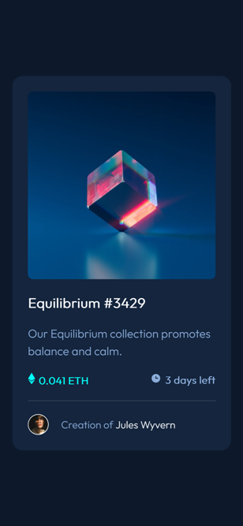

# Frontend Mentor - NFT preview card component solution

This is a solution to the [NFT preview card component challenge on Frontend Mentor](https://www.frontendmentor.io/challenges/nft-preview-card-component-SbdUL_w0U). Frontend Mentor challenges help you improve your coding skills by building realistic projects. 

## Table of contents

- [Overview](#overview)
  - [The challenge](#the-challenge)
  - [Screenshot](#screenshot)
  - [Links](#links)
- [My process](#my-process)
  - [Built with](#built-with)
  - [Useful resources](#useful-resources)
- [Author](#author)

## Overview

### The challenge

Users should be able to:

- View the optimal layout depending on their device's screen size
- See hover states for interactive elements

### Screenshot

### Links

- Solution URL: [Frontend Mentor solution](https://www.frontendmentor.io/solutions/nft-preview-card-component-AkpTAkPz4M)
- Live Site URL: [Live site at Netlify](https://auriga-nft-preview-card-comp.netlify.app/)

## My process

### Built with

- Semantic HTML5 markup
- CSS custom properties
- Flexbox
- CSS Grid

### Useful resources

- [www.w3schools.com](https://www.w3schools.com/howto/howto_css_image_overlay_icon.asp) - This helped me how to create an overlay image. 

## Author

- Frontend Mentor - [@auriga2124](https://www.frontendmentor.io/profile/auriga2124)
- Twitter - [@ErkaRahman](https://twitter.com/ErkaRahman)
